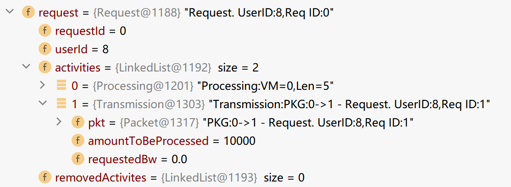
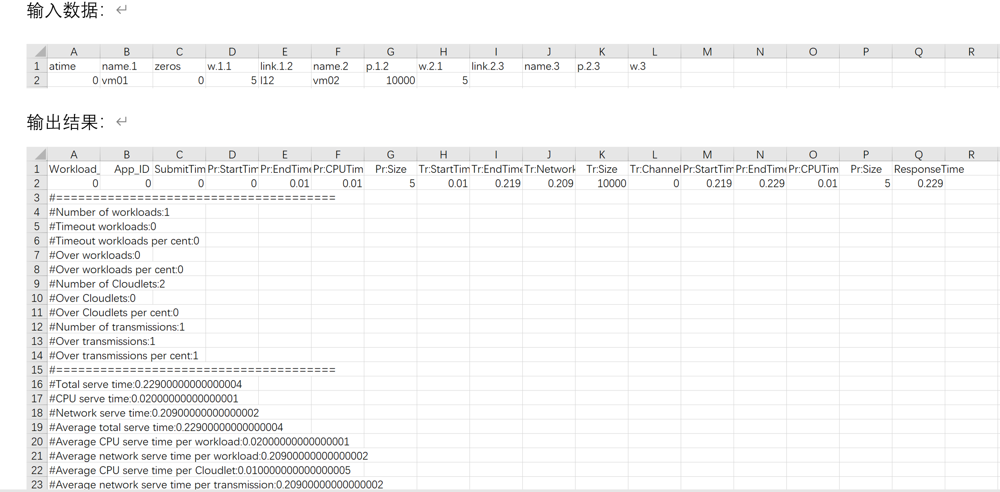
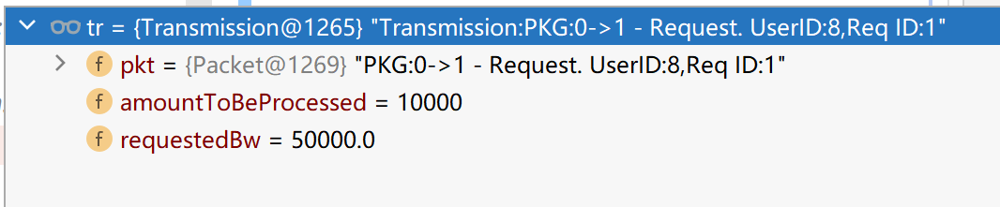
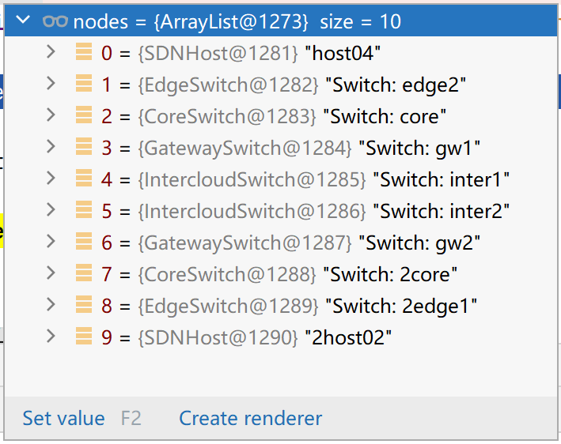
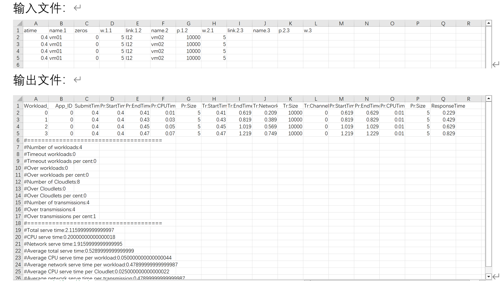
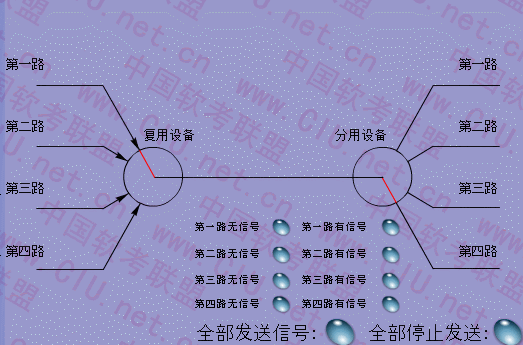

# CloudSim & SDN 仿真流程注解

丁佳阳
Configuration.java中：

```java
public static boolean ENABLE_SFC = false; // 取消sfc，方便分析
```

CloudSim.java中：

```
run():

    先 runStart():
        /** 启动(五种)实体：CloudSimShutdown、CloudInformationService(CIS)、
            NetworkOperatingSystem(NOS)、SDNDatacenter(DC)、SDNBroker(Bkr)。
         * 前两种 do nothing。
         * NOS：给自己发 MONITOR_UPDATE_UTILIZATION 类型的消息。
         * DC：向注册中心发 REGISTER_RESOURCE 消息注册自己。
         * Bkr：给自己发 APPLICATION_SUBMIT 消息，data[app的文件名]。Broker就是使用数据中心的service provider。
         */
        所有 entity 执行 startEntity();
  
    然后循环调用 runClockTick(): // 时钟每“tick”一下，激活全部实体，让他们处理这个“tick”发生的事件。
        // 处理本轮tick的事件。
        所有 entity 执行 run(): 
            /* 每个entity只会取出destID等于自己的event */
            循环 从evbuf缓存或者deferred中取出一个event，然后执行entity自己的 processEvent(event);

        // 本轮tick结束。从future中拿出下一轮tick的event(s)放入deferred。
        检查future是否有events，有就从future中取出下一轮tick的event（或多个events如果它们都属于下一轮tick，即同时发生）交给CloudSim处理。e.g.把event从future转移到deferred;
```

所有实体都继承自SimEntity抽象类，他们实现了各自的processEvent(event)：

```
processEvent(event): // 下面列举了各个子类可能收到的消息类型，与对应的处理方式
  
    [子类CloudInformationService.java]: // 注意，整个CloudSim仅一个CIS，需要时调用CloudSim.getCloudInfoServiceEntityId() 
        /* CIS还收到其他类型的消息，但不太重要，此处省略 */
        消息类型为CloudSimTags.REGISTER_RESOURCE: { 将新资源（一般是datacenter）ID添加到resList; }
    [子类SDNBroker.java]:
        消息类型为CloudSimTagsSDN.APPLICATION_SUBMIT: { 处理用户提交的文件，processApplication(brokerId作为USER, vmsFileName); }
```

处理用户提交的文件（比如s的虚拟拓扑网络）：

```
processApplication(brokerId作为USER, vmsFileName/*比如vir_topology.json*/):
    根据输入文件创建虚机、创建flow链路等等。

    创建完毕后，向自己发送消息，send(userId, 0, CloudSimTagsSDN.APPLICATION_SUBMIT_ACK, vmsFileName);

Broker收到CloudSimTagsSDN.APPLICATION_SUBMIT_ACK消息后，调用applicationSubmitCompleted():
    开始模拟工作负载，读取workload输入文件，发送request消息。
  
```

```java
    private static final int SDN_BASE = 89000000;

    public static final int SDN_PACKET_COMPLETE = SDN_BASE + 1;	// Deliver Cloudlet (computing workload) to VM
        public static final int SDN_PACKET_FAILED = SDN_BASE + 2;	// Deliver Cloudlet (computing workload) to VM
        public static final int SDN_INTERNAL_PACKET_PROCESS = SDN_BASE + 3;
        public static final int SDN_VM_CREATE_IN_GROUP = SDN_BASE + 4;
        public static final int SDN_VM_CREATE_IN_GROUP_ACK = SDN_BASE + 5;
        public static final int SDN_VM_CREATE_DYNAMIC = SDN_BASE + 6;
        public static final int SDN_VM_CREATE_DYNAMIC_ACK = SDN_BASE + 7;
        public static final int SDN_INTERNAL_CHANNEL_PROCESS = SDN_BASE + 8;

    public static final int REQUEST_SUBMIT = SDN_BASE + 10;
        public static final int REQUEST_COMPLETED = SDN_BASE + 11;
        public static final int REQUEST_OFFER_MORE = SDN_BASE + 12;
        public static final int REQUEST_FAILED = SDN_BASE + 13;

    public static final int APPLICATION_SUBMIT = SDN_BASE + 20;	// Broker -> Datacenter.
        public static final int APPLICATION_SUBMIT_ACK = SDN_BASE + 21;

    public static final int MONITOR_UPDATE_UTILIZATION = SDN_BASE + 25;
```

需注意：
所有send()产生的消息都会作为SimEvent.SEND类型的event被加入Future队列。
broker可视为一个user。

workload文件的一行就是一个request。注意Transmission->packet->payload又是一个request。从而迭代。



ps：默认的任务调度器为CloudletSchedulerSpaceShared
关于dc提交任务(cloudlet)：

```
dc收到21号消息(CloudSimTags.CLOUDLET_SUBMIT) => processCloudletSubmit()：
    updateCloudletProcessing()：//更新旧的任务状态
        遍历所有主机+虚机，调用host.updateVmsProcessing(CloudSim.clock())更新任务状态，计算最近的下一次任务完成时间，并向自己发送41号消息。  

    检查任务是否完成; // 这一步没用，第一次提交肯定是未完成。
    定位host和vm，以及vm.scheduler;
    scheduler.cloudletSubmit(cl, fileTransferTime); //fileTransferTime = 0。这一步会创建ResCloudlet记录任务的资源使用情况。
    新增任务后，调用host.updateVmsProcessing(CloudSim.clock())计算最近的下一次任务完成时间，并向自己发送41号消息。
    checkCloudletCompletion();
```

关于dc更新任务进度：

```
dc收到41号消息(CloudSimTags.VM_DATACENTER_EVENT，表示更新任务状态)：
    updateCloudletProcessing()：
        遍历所有主机+虚机，调用host.updateVmsProcessing(CloudSim.clock())更新任务状态，计算最近的下一次任务完成时间，并向自己发送41号消息。
    checkCloudletCompletion()：
        遍历所有主机+虚机，有任务(cloudlet)完成时，检查是否为request链的最后一个，若不是request链的最后一个，processNextActivity(req);
        若是就向对应客户(broker)发送20号消息(CloudSimTags.CLOUDLET_RETURN)表示这条workload已完成。
```

ps: updateCloudletProcessing()各种dc通用。而checkCloudletCompletion()SDNdc有专用实现。

cloudlet length表示需要执行的指令数量(百万为单位)。mips表示每秒执行几百万条指令(全称：Million Instructions executed Per Second)。
举例：一个length=5的cloudlet，运行在mips=500的cpu上，需要processing time=0.01秒。

nos发送packet到channel：

```
addPacketToChannel(Packet pkt)：
    若SFC开启则重写pkt的传输路径。 // SFC已关闭
    channelManager.updatePacketProcessing();
    一些auto-scaling相关的处理。 // SFC已关闭，可忽略
    根据pkt的flowId调用findChannel()。若没找到则调用createChannel()和addChannel()创建一个新的channel并发送SDB-8号SDN_INTERNAL_channel_PROCESS消息通知所有channels更新带宽。
    channel.addTransmission(new Transmission(pkt));
    sendInternalEvent() => 发送SDN-3号SDN_INTERNAL_packet_PROCESS消息，让nos调用channelManager.updatePacketProcessing()处理channels里的packets。

channelManager.updatePacketProcessing()：
    找出所有完成传输的channels，调用nos.processCompletePackets(completeChannels)向接收dc发送SDN-1号SDN_PACKET_COMPLETE消息，并调用updateChannel()删除空闲 channels。
```

## 案例分析：以clocktick为断点的单个负载分析

仅一条workload，且关闭SFC功能。



- clocktick-2：**[Time =0.0, Event tag = 89000020 source = Broker destination = Broker]** broker(用户)收到自己发来的SDN-20号消息(`APPLICATION_SUBMIT`)。调用 `processApplication()`根据“虚拟拓扑文件”创建虚机、创建flow链路等等。
- clocktick-3：**[Time =0.0, Event tag = 89000021 source = Broker destination = Broker]** broker(用户)收到自己发来的SDN-21号消息(`APPLICATION_SUBMIT_ACK`)。调用 `applicationSubmitCompleted()`开始模拟工作负载。读取workload输入文件，创建request和相关events。

request解析：workload文件的一行就是一个**request链**。通过request里嵌套request达成。举例：若workload包含3个请求，则request组成为request1[request2(request3)]。 最外层request1包含request2，request2包含request3。每次处理即剥开外层，取出下一个request。
request链具体可见下图，Activities->Transmission->packet->payload又是一个request。


- clocktick-4：**[Time =0.0, Event tag = 89000010 source = Broker destination = dc1]** 1号数据中心(dc1)收到broker发来的SDN-10号消息(`REQUEST_SUBMIT`)。dc1剥开request0，拿走第一层processing，构建cloudlet0并发消息，剩下的包裹成request1。同时dc1在自己的requestsTable里记录cloudlet0=>request1的映射，当dc1执行完cloudlet0后查表，会发request1给下一步执行的虚机。
- clocktick-5：**[Time =0.0, Event tag = 21 source = dc1 destination = dc1]** dc1收到自己发来的21号消息(`CLOUDLET_SUBMIT`)，调用processCloudletSubmit()。本案例中是调度任务到对应的虚机上。

```
processCloudletSubmit()：
    updateCloudletProcessing()：//更新任务(cloudlets)状态。注意，此刻还没有任务。
        遍历所有主机+虚机，调用host.updateVmsProcessing(CloudSim.clock())更新任务状态，计算最近的一次任务完成时间，并向自己发送41号消息。  

    检查待提交的任务是否完成; // 没用。肯定是未完成。
    定位host和vm，以及vm.scheduler。然后scheduler.cloudletSubmit(cl, fileTransferTime); //提交任务，并创建相应的ResCloudlet来记录任务的资源使用情况。fileTransferTime没用可忽略。
    新增任务后，调用host.updateVmsProcessing(CloudSim.clock())计算最近的一次任务完成时间，并向自己发送41号消息。
    checkCloudletCompletion(); // 没用。
```

- clocktick-6：**[Time =0.01, Event tag = 41 source = dc1 destination = dc1]** dc1收到自己发来的41号消息(`VM_DATACENTER_EVENT`)。该消息说明有任务完成，dc1调用updateCloudletProcessing()和checkCloudletCompletion()更新任务状态。本案例中，cloudlet0已完成，需要发包到channel给dc2，具体动作包含创建channel和发包到channel。

  $\color{red}{cloudlet0用时0.01秒。}$具体计算：它的length=5m(有5 million条指令需要运行)，运行在mips=500m/s的cpu上，需要processing time=0.01s。

```
dc收到41号消息(CloudSimTags.VM_DATACENTER_EVENT)：
    updateCloudletProcessing()：
        遍历所有主机+虚机，调用host.updateVmsProcessing(CloudSim.clock())更新任务状态，计算最近的一次任务完成时间，并向自己发送41号消息。
    checkCloudletCompletion()：
        遍历所有主机+虚机，若有任务(cloudlet)完成，检查是否为request链的最后一个任务，若不是，则从requestsTable中取出cloudlet后面的req，并调用processNextActivity(req) => 由nos(数据中心的操作系统)从req中取出packet然后addPacketToChannel()。

        若是最后一个，就向对应客户(broker)发送SDN-11号消息(REQUEST_COMPLETED)表示这条request链已完成。

addPacketToChannel(Packet pkt)：
    若SFC开启则重写pkt的传输路径。 // SFC已关闭
    channelManager.updatePacketProcessing()处理之前的包; // 此案例中没有之前的包 
    一些auto-scaling相关的处理。 // SFC已关闭，可忽略
    根据pkt的flowId调用findChannel()。若没找到则调用createChannel()和addChannel()创建一个新的channel并发送SDB-8号SDN_INTERNAL_channel_PROCESS消息通知所有channels更新带宽。
    channel.addTransmission(new Transmission(pkt));
    sendInternalEvent() => 发送SDN-3号SDN_INTERNAL_packet_PROCESS消息，让nos调用channelManager.updatePacketProcessing()处理channels里的packets。

channelManager.updatePacketProcessing()：
    找出所有完成传输的channels，调用nos.processCompletePackets(completeChannels)向接收dc发送SDN-1号SDN_PACKET_COMPLETE消息，并调用updateChannel()删除空闲 channels。
```

- clocktick-7：**[Time =0.01, Event tag = 89000008 source = NOS_dc1 destination = NOS_dc1]** dc1的nos收到自己发来的SDN-8号消息(`SDN_INTERNAL_CHANNEL_PROCESS`)。此消息说明有新的channel被创建，受其影响，检查所有channels的带宽并更新。
- clocktick-8：**[Time =0.21000000000000002, Event tag = 89000003 source = NOS_dc1 destination = NOS_dc1]** dc1的nos收到自己发来的SDN-3号消息(`SDN_INTERNAL_PACKET_PROCESS`)。此案例中，说明包已经传输完毕，向接收方dc2发送SDN-1号消息。
  $\color{red}{transmission用时0.2秒。}$具体计算：如下图所示：packageSize=10000，channel带宽=50000，需要transmission time=0.2s。累记0.01+0.2=0.21s。"0.21000000000000002"后面一长串0是因为java的浮点数加法误差导致。



- clocktick-9：**[忽略]** 用于销毁空闲channels。
- clocktick-10：**[Time =0.21900000000000003, Event tag = 89000001 source = NOS_dc1 destination = dc2]** dc2收到SDN-1号消息(`SDN_PACKET_COMPLETE`)，说明已收到包。dc2从packet中取出请求req，然后processNextActivity(req)。本案例中，workload是简单的"vm1_processing + transmission_to_vm2 + vm2_processing"。因此待处理的activity是最后一个processing任务。

  $\color{red}{transmission延迟0.009秒。}$具体计算：如下图所示：channel共需要经过9个物理links，每个link延迟0.001s。总共0.009s。累记0.01+0.2+0.009=0.219s。



- clocktick-11：**[Time =0.21900000000000003, Event tag = 21 source = dc2 destination = dc2]** dc2收到消息(`CLOUDLET_SUBMIT`)，调用processCloudletSubmit()调度任务cloudlet1到对应的虚机上。
- clocktick-12：**[Time =0.22900000000000004, Event tag = 41 source = dc2 destination = dc2]** dc2收到消息(`VM_DATACENTER_EVENT`)。更新任务状态(任务cloudlet1已完成)，调用updateCloudletProcessing()和checkCloudletCompletion()。本案例中，最后一个processing已完成，整个request链全部完成。

  $\color{red}{cloudlet1用时0.01秒。因此响应时间：0.01+0.2+0.009+0.01=0.229s。}$
- clocktick-13：**[Time =0.23900000000000005, Event tag = 89000011 source = dc2 destination = Broker]** broker收到SDN-11号消息(`REQUEST_COMPLETED`)，该条workload已完成，调用wl.writeResult()记录结果。
- clocktick-14：**[Time =1.0, Event tag = 89000025]** 收尾，计算资源利用率。

## 多条负载



- $\color{blue}{0.4s}$创建4个workloads。
- 经过0.01s后在$\color{blue}{0.41s}$时cloudlet1-1完成，开始传输。
  根据带宽，发送完全部的packet碎片需要0.2s的时间，再加上0.009s的物理链路延迟，在$\color{blue}{0.619s}$时packet全部碎片抵达vm2。
  vm2创建cloudlet2-1，经过0.01s在0.629s时cloudlet2-1完成，workload1结束。
  $\color{red}{响应时间：0.629-0.4 = 0.229s}$
- 0.41s时上一个任务完成，再经过0.01s的调度时间和0.01s的任务执行时间，在$\color{blue}{0.43s}$时cloudlet1-2完成，但信道被使用，等到0.61s(上一个packet的全部碎片完成发送)时开始传输。
  根据带宽，需要0.2s的发送时间，再加上0.009s的物理链路延迟，在$\color{blue}{0.819s}$时packet抵达vm2。
  vm2创建cloudlet2-2，经过0.01s在0.829s时cloudlet2-2完成，workload2结束。
  $\color{red}{响应时间：0.829-0.4 = 0.429s}$
- $\color{blue}{0.45s}$时cloudlet1-3完成，同理，0.81+0.2+0.009+0.01 = 1.029s时workload3结束。
  $\color{red}{响应时间：1.029-0.4 = 0.629s}$
- $\color{blue}{0.47s}$时cloudlet1-4完成，同理，1.01+0.2+0.009+0.01 = 1.229s时workload4结束。
  $\color{red}{响应时间：1.229-0.4 = 0.829s}$


TDMA改造：



